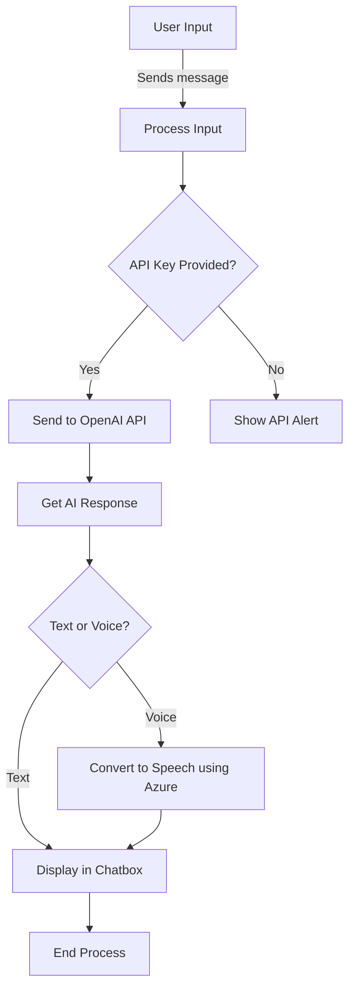

# Hermes Castano AI Chatbot

This project is an interactive representation of "me", Hermes Castano, turned into an AI for interviews and conversations with recruiters. It's designed to simulate a real interview experience where recruiters can directly interact with the AI. This documentation is aimed at providing technical information to support analysts and developers working with the AI.

## Project Overview

The chatbot is a representation of Hermes Castano, designed to respond to interview questions, share technical experience, and provide insightful answers based on temporarily stored context. **The program is accessible via a web browser**, where the OpenAI API key and the Azure Speech key are passed as URL parameters.

The chatbot leverages the following features:
- **Personalized responses** based on the context of previous conversations.
- **Hint buttons** for common interview questions that the recruiter can click to interact easily.
- **Temporary conversation storage**, which allows the AI to refer back to past user messages and give insightful responses.
- **Voice synthesis** using the **Azure Speech SDK** to convert text-based responses into speech.
- **API key handling** via URL query parameters, allowing dynamic usage without exposing the API keys in the source code.

## Functionality

1. **Context-Aware Responses**:
   The AI chatbot temporarily stores the conversation history in memory. While the chatbot doesn’t have a persistent database, it keeps the session context to provide coherent, context-aware responses during the session. Each time a new session is started, the history is reset.

2. **Handling API Keys via URL Parameters**:
   To interact with OpenAI and Azure Speech, the program captures the API keys from the URL. The API keys for OpenAI and Azure must be passed as query parameters when accessing the application.

   ### Example URL:
   ```
   index.html?openai_key=your_openai_api_key&azure_key=your_azure_api_key
   ```

   ### Code to Get Query Parameters from the URL:
   ```javascript
   Function to get query parameters from the URL
   function getQueryParams(param) {
     const urlParams = new URLSearchParams(window.location.search);
     return urlParams.get(param);
   }

   Get the OpenAI and Azure API keys from the URL
   const openAiApiKey = getQueryParams('openai_key');
   const azureSpeechKey = getQueryParams('azure_key');
   ```

   If the API keys are not provided in the URL, the application shows an alert box asking for the keys:
   ```javascript
   if (!openAiApiKey || !azureSpeechKey) {
     alert('No API keys found in the URL. Please provide the OpenAI key and Azure key as query parameters.');
   }
   ```

3. **Azure Speech SDK**:
   The chatbot uses **Azure Speech SDK** for voice synthesis, which allows the AI to speak the responses provided by OpenAI. The SDK is initialized and triggered for each response.

   ### Example of Azure Speech SDK Initialization:
   ```javascript
   const speechConfig = SpeechSDK.SpeechConfig.fromSubscription(azureSpeechKey, 'eastus');
   const synthesizer = new SpeechSDK.SpeechSynthesizer(speechConfig);
   ```

4. **Temporary Conversation History**:
   The chatbot keeps a record of the conversation during the session. This helps in providing context-aware responses. However, since there is no database, the conversation history is reset every time a new session starts.

   ### Example of Storing Conversation Context:
   ```javascript
   let conversationHistory = [];

   Add user message to the conversation history
   conversationHistory.push({ role: "user", content: userMessage });
   ```

5. **Alert if API Keys Are Missing**:
   If the API keys are not provided in the URL, the application alerts the user that the keys are required to proceed. This ensures that the system is not used without proper authorization.

6. **Hint Buttons for Common Questions**:
   The interface includes hint buttons for common interview questions, such as "Tell me about your professional experiences" or "Do you know about APIs and SQL?". When a recruiter clicks on one of these hints, it is automatically sent as input to the chatbot, and the hint disappears after use.

7. **Shut Up Button**:
   A "Shut Up, Hermes" button is available to stop the voice synthesis if the user wishes to mute Hermes mid-speech. **However, there is currently a bug** where the Azure Speech SDK does not properly stop the speech when interrupted, which will be addressed in future updates.

## Concepts Used

- **API (Application Programming Interface)**: We are using RESTful APIs to interact with both OpenAI and Azure services. REST (Representational State Transfer) is a software architectural style that uses HTTP requests for communication, which is exactly what we do in this project.
- **RESTful API**: Both OpenAI and Azure are accessed through RESTful APIs, where we send HTTP POST requests with structured data in JSON format to get responses.
- **SDK (Software Development Kit)**: For Azure Speech, we use the Azure Speech SDK to handle voice synthesis, which provides easy-to-use methods for converting text into speech.
- **Languages**: The project primarily uses HTML, CSS, and JavaScript (vanilla). JavaScript handles the communication with APIs, voice synthesis, and user interactions.

## Technologies Used

- **HTML/CSS**: For structuring the webpage and styling the chatbot interface.
- **JavaScript (Vanilla)**: Handles the logic for sending and receiving messages, voice synthesis, and managing the conversation history.
- **OpenAI GPT-3.5 Turbo**: Provides the AI responses based on the conversation context.
- **Azure Speech SDK**: Used to convert the AI’s text responses into synthesized speech.
- **RESTful API**: OpenAI and Azure services are accessed via REST APIs to handle conversation and speech functionality.

## Example API URL:

To use the application with your own API keys, access the page using a URL with the following structure:

```
https://username.github.io/repository-name/index.html?openai_key=your_openai_key&azure_key=your_azure_key
```

## Basic Program Flow (Mermaid Diagram)



## Known Issues & Future Updates

- **Interrupting Speech**: Currently, the Azure Speech SDK does not properly interrupt the speech synthesis when the "Shut Up, Hermes" button is clicked. This is a known issue and will be fixed in a future release.
- **Shut Up Button**: The button currently triggers, but does not stop the voice synthesis as expected.
- **Session Management**: Each session resets when the page is refreshed, as there is no persistent database. Future updates may include adding session storage or connecting a database to maintain conversation history across sessions.

## Future Plans

- Fixing the speech interruption bug to allow seamless control over the voice synthesis.
- Improving session management by adding local storage or a simple backend to save conversation history.
- Adding more customizable hints and predefined questions to improve the recruiter's interaction experience.
"# hermes-ai1" 
